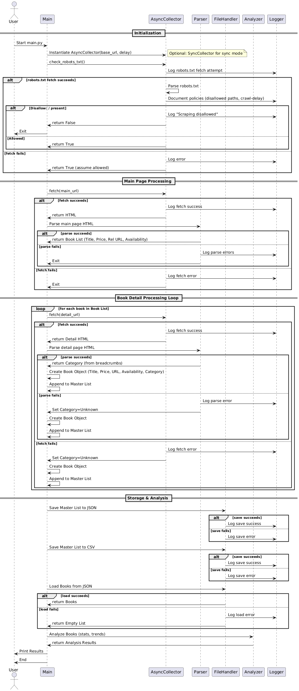

# Python Web Scraping Midterm Project

A modular scraping and data analysis toolkit featuring asynchronous collection, GUI visualization, and robust testing.

## Features

- Async and synchronous scraping options
- Robots.txt compliance and polite rate limiting
- BeautifulSoup4 parsing with multiple selectors
- Object-oriented data modeling
- Saves data to CSV & JSON
- Data analysis tools (counts, averages, availability)
- Tkinter GUI to browse data and charts
- Matplotlib data visualizations
- Unit tests for key modules

## Setup

```bash
pip install -r requirements.txt
```

## Usage

**Scrape synchronously:**

```bash
python main.py
```

**Scrape asynchronously (example):**

```bash
python main.py --async
```


**Run GUI viewer:**

```bash
python gui.py
```

**Run tests:**

```bash
python3 -m unittest discover -s tests
```

## Project Structure

```
.
├── .gitignore                 # Specifies intentionally untracked files that Git should ignore
├── CONTRIBUTIONS.md           # Contribution guidelines
├── LICENSE                    # Project license file
├── README.md                  # This file
├── REPORT.md                  # Project report document
├── gui.py                     # Main script for the Tkinter GUI data viewer
├── main.py                    # Main script to run the scraper (sync/async)
├── requirements.txt           # Python package dependencies
├── robots.txt                 # Standard for web crawlers (example/template)
├── scraper_workflow.md        # Detailed description of the scraping workflow
├── webscraper-sequence-diagram.png # Visual diagram of the workflow
├── data/                      # Directory for storing output data
│   ├── books.csv              # Scraped book data in CSV format
│   └── books.json             # Scraped book data in JSON format
├── models/                    # Contains data model definitions
│   ├── __init__.py            # Makes 'models' a Python package
│   └── data_models.py         # Defines the Book data structure
├── scraper/                   # Core scraping logic
│   ├── __init__.py            # Makes 'scraper' a Python package
│   ├── async_collector.py     # Asynchronous data collection logic (aiohttp)
│   ├── collector.py           # Synchronous data collection logic (requests)
│   └── parser.py              # HTML parsing logic (BeautifulSoup)
├── tests/                     # Unit and integration tests
│   └── test_scraper.py        # Tests for the scraper module
└── utils/                     # Utility functions and classes
    ├── __init__.py            # Makes 'utils' a Python package
    ├── analyzer.py            # Data analysis functions
    └── file_handler.py        # Functions for reading/writing data files
```

## Dependencies

- requests
- beautifulsoup4
- aiohttp (async requests)
- matplotlib (plots)
- pytest (testing)
- tkinter (standard lib, GUI)

## Notes

- Practicing ethical scraping with respect for robots.txt and server limits.
## Documented Limitations

- Does not handle JavaScript-rendered pages (static HTML only).
- Robots.txt parsing is simplistic; does not consider user-agent specific rules or crawl-delay.
- Assumes book page structure is consistent and fixed.
- No retry logic on failed requests.
- Minimal error reporting in GUI.

## Potential Improvements

- Add automatic retries/backoff on network failures.
- Improve robots.txt parsing with `robotparser` or external libs.
- Support paginated listings to scrape all pages.
- Add proxy support for large scraping runs.
- Improve GUI: filtering, search, export.
- Enhance test coverage for edge cases.
- Deployment via Docker for easier setup.


## Workflow Sequence Diagram

The following sequence diagram illustrates the interaction between the different components of the web scraper during its execution:

1.  **Initialization:** The `main.py` script starts, instantiates the appropriate collector (`AsyncCollector` or `Collector`), and checks the target site's `robots.txt` file for scraping permissions via the collector. Logging is performed for key actions and outcomes.
2.  **Main Page Processing:** If allowed, the collector fetches the main page HTML. The `Parser` extracts initial book details (title, price, relative URL, availability) from this HTML. Errors during fetching or parsing can lead to termination or logging.
3.  **Detail Page Loop:** For each book found, the collector fetches the individual book's detail page. The `Parser` extracts the category from the detail page HTML. A complete `Book` object is created and added to a master list. Errors during fetching or parsing result in logging and potentially setting the category to "Unknown".
4.  **Storage & Analysis:** Once all books from the main page are processed, the `FileHandler` saves the master list to both `books.json` and `books.csv`, logging success or errors. The data is then reloaded (handling potential load errors), and the `Analyzer` calculates statistics (like counts and averages per category), which are printed to the console before the script ends.
5.  **Logging:** The `Logger` participant represents Python's logging module, recording key steps, decisions, and errors throughout the process for debugging and monitoring.


