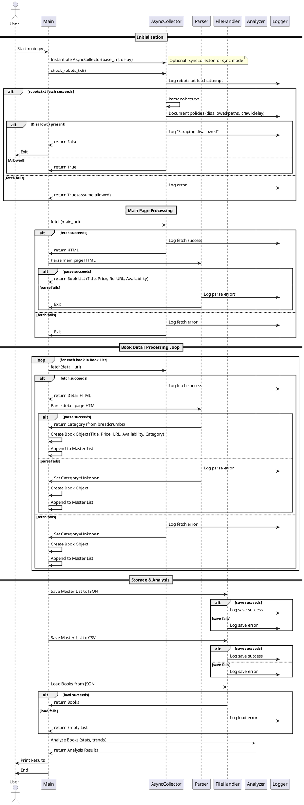

# Scraper Workflow

This document outlines the execution flow of the web scraper.

**Key Modules Involved:**

*   `main.py`: Orchestrates the overall process, handles command-line arguments (sync/async).
*   `scraper/collector.py`: Handles synchronous HTTP requests, rate limiting, `robots.txt`.
*   `scraper/async_collector.py`: Handles asynchronous HTTP requests using `aiohttp`, rate limiting, `robots.txt`.
*   `scraper/parser.py`: Uses BeautifulSoup4 to parse HTML and extract specific data elements.
*   `models/data_models.py`: Defines the `Book` class structure.
*   `utils/file_handler.py`: Saves and loads `Book` objects to/from JSON and CSV files.
*   `utils/analyzer.py`: Provides functions to perform analysis on the list of `Book` objects.